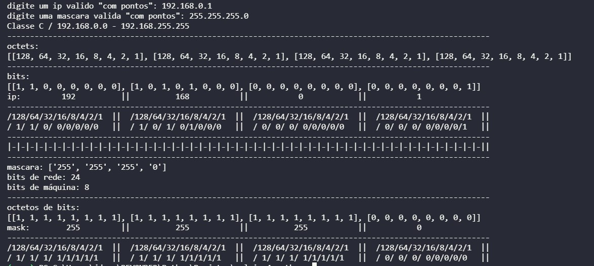
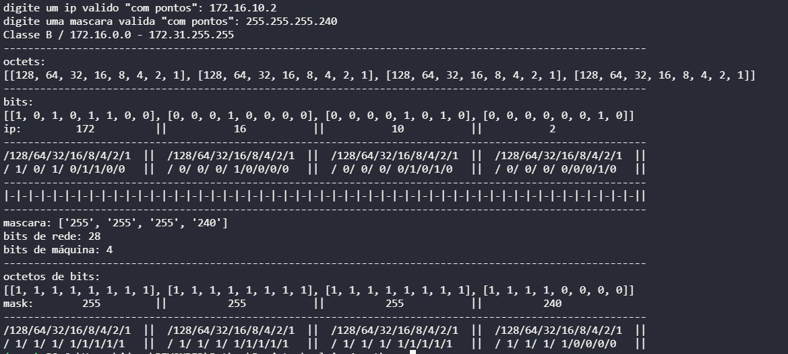

# calc-ipv4-python

## Description
Exibi no console de maneira simplificada o cálculo do funcionamento do ipv4  
Por em enquanto não está validado então digite um endereço de ip válido para que faça mais sentido a exibição
Após digitar um ip pedirá uma máscara (digite uma máscara de rede válida) para que calcule o número de bits para redes e máquinas

### Exemplos de mascaras:  
255.0.0.0 para classe A  
255.255.0.0 para classe B  
255.255.255.0 para classe C  

Podemos ver o comportamento dos bits com classless:

